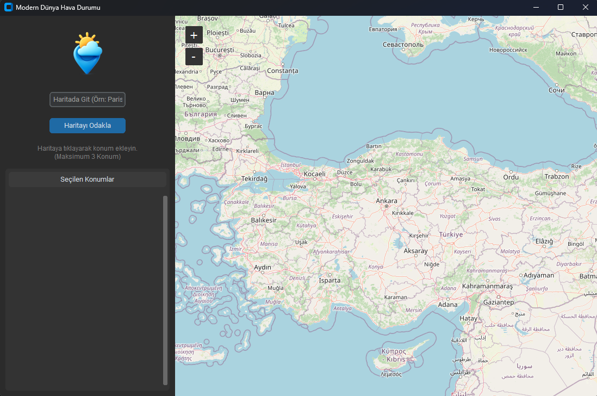

# 🌍 Modern Dünya Hava Durumu (Weather Map Tracker)


Modern Hava Durumu, klasik hava durumu uygulamalarının aksine, interaktif bir dünya haritası üzerinde istediğiniz konuma tıklayarak anlık verileri takip etmenizi sağlayan akıllı bir masaüstü uygulamasıdır.

"Hava durumu takibi hiç bu kadar keyifli ve modern olmamıştı."



# 🌟 Öne Çıkan Özellikler

* 🗺️ İnteraktif Dünya Haritası: Google Maps benzeri bir deneyimle dünyayı gezinin, yakınlaşın ve istediğiniz noktaya tıklayın.

*📍 Akıllı Konum Algılama (Reverse Geocoding): Tıkladığınız koordinatın hangi il veya ilçe olduğunu otomatik algılar ve isme göre en doğru veriyi çeker.

* 🌡️ Canlı ve Anlık Veri: OpenWeatherMap API ile saniyelik sıcaklık, nem ve rüzgar bilgilerini getirir.

* 📌 Çoklu Takip Sistemi: Harita üzerine aynı anda 3 farklı iğne bırakabilir ve sol panelde hepsini aynı anda kıyaslayabilirsiniz.

* 🛡️ Hata Toleransı: Eğer şehir ismi API tarafından tanınmazsa, otomatik olarak koordinat moduna geçer ve veriyi garantiler.

* 🎨 Modern Arayüz: CustomTkinter ile göz yormayan, şık "Dark Mode" tasarımı.

* 📦 Kurulumsuz (Portable): Tek bir .exe dosyası olarak çalışabilir.

* 📥 İndirme ve Kullanım (Kullanıcılar İçin)

Programı Python bilmenize gerek kalmadan kullanmak için:

Bu sayfanın sağ tarafındaki "Releases" kısmından en son sürümü (HavaDurumu_v1.exe) indirin.

İndirdiğiniz .exe dosyasına çift tıklayın.

"Haritada Git" kutusuna bir şehir yazın veya harita üzerinde gezinin.

İstediğiniz noktaya tıklayın ve sol panelde verilerin belirmesini izleyin!

# 🛠️ Kurulum (Geliştiriciler İçin)

Bu proje, modern Python kütüphanelerinin gücüyle geliştirilmiştir:

Kütüphane

Amaç

* 🐍 CustomTkinter

Modern, yuvarlak hatlı ve karanlık mod destekli arayüz (UI) tasarımı.

* 🌍 TkinterMapView

Harita görüntüleme, tile server yönetimi ve marker işlemleri.

* ☁️ Requests

OpenWeatherMap ve Nominatim API'leri ile HTTP iletişimi.

* 🖼️ Pillow (PIL)

Logo ve ikon işleme, görsel yönetimi.

* ⚙️ PyInstaller

Python kodunu tek parça .exe haline getirme.

* 💻 Geliştiriciler İçin Kurulum (Developers)

Kaynak kodunu geliştirmek, kendi API anahtarınızı eklemek veya incelemek isterseniz:

Repoyu klonlayın:
 ``` bash
# Windows (PowerShell)
git clone [https://github.com/Omer-Murat/Modern-Hava-Durumu.git](https://github.com/Omer-Murat/Modern-Hava-Durumu.git)
cd Modern-Hava-Durumu
 ```

Gereksinimleri yükleyin:
 ``` bash
# Windows (PowerShell)
pip install -r requirements.txt
 ```

API Anahtarını Ayarlayın:

HavaDurumuApp.py dosyasını açın.

API_KEY değişkenine kendi OpenWeatherMap anahtarınızı yapıştırın.

Uygulamayı çalıştırın:

python HavaDurumuApp.py


# 📦 EXE Nasıl Derlenir? (Build)

Projeyi tek dosya haline getirmek ve ikon/logo dosyasını içine gömmek için şu komutu kullanın:


 ``` bash
# Windows (Terminal veya PowerShell)
pyinstaller --noconsole --onefile --add-data "logo.png;." --icon=logo.png --name="HavaDurumuApp" HavaDurumuApp.py
 ```

* (logo.png dosyasının proje klasöründe olduğundan emin olun.)

* Not: Bu proje eğitim amaçlıdır. Telif haklarına saygı gösteriniz.

Lisans: Bu proje MIT Lisansı ile sunulmaktadır.

Geliştirici: Ömer Murat
